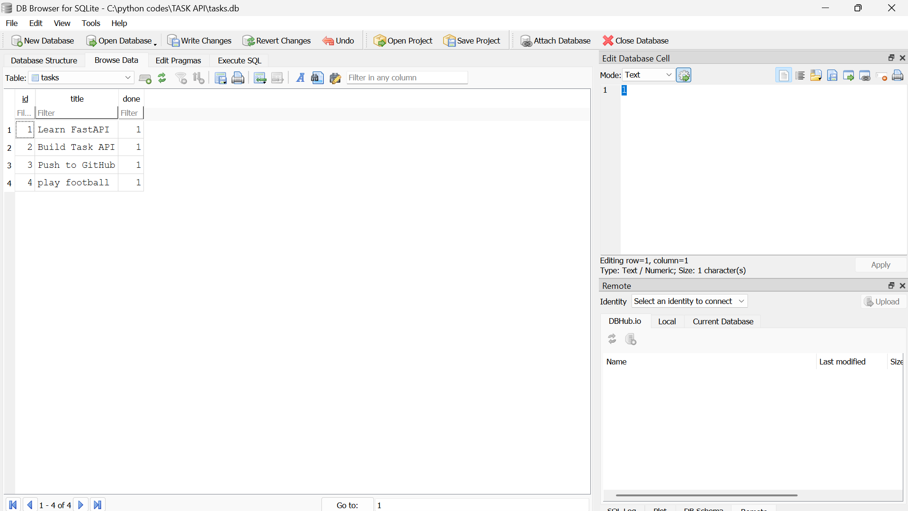

# Task API (FastAPI + SQLite)

A simple CRUD REST API built with FastAPI and SQLite as part of the FlyRank Python Backend Assignment.

## Features

- Get all tasks
- Get a task by ID
- Create a new task
- Update an existing task
- Delete a task
- SQLite database integration
- Automatic Swagger API documentation

---

## Technologies Used

- Python 3
- FastAPI
- SQLite
- Uvicorn
- Pydantic

---

## Why SQLite?

SQLite was chosen because it is lightweight, requires no separate database server, and stores the entire database in a single file. It is perfect for learning backend development and small applications.

---

## Database Location

The database is stored locally in the project directory as:

```
tasks.db
```

The application automatically creates the database and inserts the default tasks if the database is empty.

---

## Installation

Clone the repository:

```bash
git clone https://github.com/AbdulHadi638/flyrank_crud_task-api.git
```

Move into the project folder:

```bash
cd flyrank_crud_task-api
```

Install the required packages:

```bash
pip install fastapi uvicorn
```

---

## Running the Server

```bash
py -m uvicorn main:app --reload
```

The API will be available at:

```
http://127.0.0.1:8000
```

Swagger UI:

```
http://127.0.0.1:8000/docs
```

---

## API Endpoints

| Method | Endpoint | Description |
|--------|----------|-------------|
| GET | /tasks | Get all tasks |
| GET | /tasks/{id} | Get a task by ID |
| POST | /tasks | Create a task |
| PUT | /tasks/{id} | Update a task |
| DELETE | /tasks/{id} | Delete a task |

---

## Example SQL Query

Retrieve all tasks:

```sql
SELECT * FROM tasks;
```

---

## Database Viewer Screenshot


```markdown

```

---


## Author

Abdul Hadi